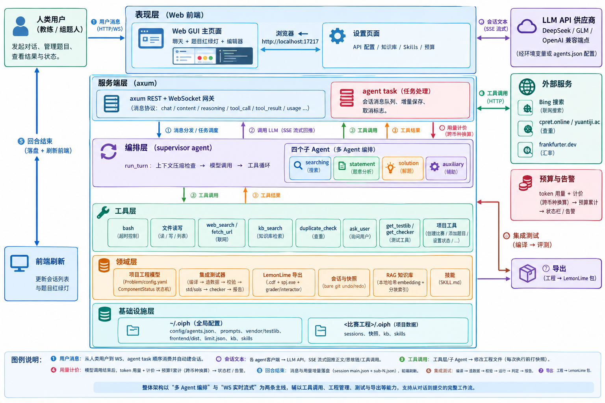

# OIPH 设计文档

OIPH（OI Problem-setter Helper）是面向 OI（信息学奥林匹克）模拟赛组题场景的 Agent 系统：用户以自然语言指挥一名 supervisor Agent，由其调度多名专用子 Agent（搜索 / 题面 / 解法 / 辅助程序）与 20+ 工具，完成"原创/搬运/改编题目 → 查重 → 写题面 / std / 题解 → 造数据 → 集成测试 → 导出"的完整组题流水线。

---

## 一、痛点分析

### 1.1 为什么这是痛点

模拟赛是 OI 训练的核心手段，而"组一场比赛"长期是一项**以天为单位的重复性苦役**，且完全无法避免：

- **搜题**：要找到"冷门得恰到好处"的题——难度符合、知识点对口、且学员大概率没做过。教练需要在一堆零散来源（QOJ 搬运区、CodeChef、PA、KOI、IZhO、AtCoder 远古场……）里翻找，逐道评估。
- **查重**：每道候选题都要判断"学员见过没有"。这依赖对各大 OJ 提交人数、题解博客的模糊记忆与人工搜索。
- **配套资料**：官方数据与 std 往往不公开（如 KOI 只给压缩包里的输入/输出、不给标程），需要自己补 std、补数据、写题解。
- **工程细节**：每道题都要写 generator / validator / checker / 交互库，造数据要考虑边界与极限；传统题、函数交互题、IO 交互题、提交答案题四类题型的编译与评测方式完全不同，一步错就整题 RE/TLE/WA，却难以定位。
- **分发**：学校评测环境多种多样（LemonLime、SYZOJ、HydroOJ……），打包导出的格式细节（SPJ 的 `registerLemonChecker`、文件名约定、`.cdf` 结构）琐碎且易错。
- **费用与资源**：LLM API 有 DeepSeek 峰谷计价、GLM/OpenAI 等不同计价体系，长会话 token 失控、预算超支是真实风险。

具体例子：

> 教练想给下周训练赛出一道"交互题 + 数据结构"的组合。他先花一个晚上在 QOJ 与 CodeChef 翻题，筛出 3 道候选；挨个搜中文题解判断学员见过的概率；选中后开始造数据——手写 generator，跑 validator 校验却发现 validator 忘了从 stdin 读入（testlib 约定），排查半小时；写 checker 时把 `registerTestlibCmd` 的参数顺序传错（应为 input / output / answer），集成测试反复 RE；最后想导出到 LemonLime 评测，又发现 SPJ 不兼容……一场两小时的比赛，准备期三到五个晚上。

### 1.2 现有工具为什么解决不好

- **通用编程 Agent** 不懂 OI 生态：不知道去哪里找冷门题与官方数据，不熟悉 OJ 平台的查重/评测细节；它们面向"写代码"，而非"交付一份可评测的比赛产物"。让它们写出的 checker 常常不符合 testlib 约定，生成的数据缺乏强度论证。
- **互相独立的 AI 小工具**：目前网上有"单题生成""找原题""造数据"等孤立的工具，但——各工具之间产物格式不互通，组题人需要在多个网页/脚本间搬运文件；没有一道题从 idea 到可评测产物的**端到端工作流**；对"搬运 / 改编"这一 OI 模拟赛组题的常态更是几乎没有 AI 辅助工具。
- **Polygon、tuack 等专业平台**：提供比赛工程管理、集成测试等功能，但过于繁琐的操作流程反而可能降低人工效率。
- **人工 + 文档**：经验可以沉淀成文档（本文档配套的 `assets/kb/` 就内置了题库知识），但检索与执行仍是手工的，无法自动化、规模化。

---

## 二、场景定制方案

针对"OI 组题"这一场景，OIPH 做了以下专门定制：

### 2.1 多角色 Agent 编排 + 领域化工具集

把组题流程拆成角色分工，而不是让一个通用 agent 包办：

- **supervisor**：唯一与用户对话的角色。负责任务规划（原创流程 / 搬运流程）、调用查重、派活给子 Agent、以 `RESULT: OK/FAILED` 标志验收子 Agent 成果、向用户汇报。
- **searching / statement / solution / auxiliary** 四个子 Agent：分别负责"找冷门题与资料""写题面与题解""设计算法写 std 与错解""写 generator/checker/validator/交互库并造数据"。子 Agent 只有受限工具（如 `get_problem`），各自使用**独立的系统提示词**（`~/.oiph/config/prompts/*.md`，可热编辑）与**独立的模型配置**（base_url / api_key / model / 思考模式 / max_context，均可按 agent 单独设置，留空则回退环境变量 `OPENAI_BASE_URL` 等）。
- 工具集为领域定制：`create_contest / add_problem / set_status / add_solution / duplicate_check / check_data / check_std / check_solutions / test_integrity / ask_user / get_testlib / get_checker` + 通用 `bash / read_file / write_file / web_search / fetch_url / kb_search`。
- **实现要点**：工具用 OpenAI function-calling schema 声明（`FunctionDef`，含中文描述引导模型正确传参）；工具结果以 `tool` 消息回填并保证与 `assistant.tool_calls` 一一对应（`session::repair_tool_history` 会在加载时自动补缺，避免 API 400）；bash 工具与通用 agent 的 bash 工具不同，支持 `timeout_secs` 参数（默认 20s），超时杀进程组并**把超时说明作为工具结果返回给模型**，让模型自行决定加大超时重试。

### 2.2 真实可评测的题目工程 + 按题型区分的集成测试器

- 题目不再是"一堆散文件"：`create_contest/add_problem` 生成规范目录（`config.yaml`、`statement/zh_cn.md`、`tutorial/zh_cn.md`、`data/`、`auxiliary/`、`solutions/`），config.yaml 里是完整的领域模型 `Problem`（题型、来源、标签、时限、subtasks 依赖与分值、data_gen、各组件状态机 `ComponentStatus`、查重记录等），**GUI 据此渲染完成度红绿灯**，任何 Agent 都能通过 `get_problem` 看见全貌。
- **`test_integrity` 集成测试器（test_runner.rs）**把"评测系统会怎么跑这道题"真实复现一遍：编译 auxiliary 程序与 std/sols → generator 生成/复制数据 → validator 以 stdin 重定向逐点校验 → 按**题型分派不同运行管线**：
  - 传统题：`std < i.in > i.ans`，checker(i.in, out, ans) 判定；
  - 函数交互题：`<pid>.h + interactive_lib.cpp` 与选手代码同目录联合编译，运行同传统题；
  - IO 交互题：`interactive_lib.cpp` 单独编译为 grader，用 **mkfifo 双向管道**把选手程序与 grader 连起来，并用 `${PIPESTATUS[0]}` 精确检查 grader 退出码（非 0 记 RE）；
  - 提交答案题：无 std，sol 是目录（内含各点输出文件），直接用 checker 与 `data/*.ans` 比对。
  - 每个 sol 与 config 中 `expected.verdict` 比对（预期 AC 须全点 AC；预期 WA/TLE 至少一点命中），并对 TLE/超时告警。
  - 所有子进程都有 `timeout` 包裹，杜绝"评测挂起导致请求永不返回"；checker 缺失直接报错而不是悄悄退化为 diff。
- 所有 C++ 程序统一以 testlib.h 为基底——**testlib.h 不内嵌进二进制**，由 init 安装到 `~/.oiph/vendor/`（原版与 LemonLime 兼容版各一），用户可自行升级而无需重编译。

### 2.3 可中断、可回滚、可续命的 Agent 会话层

- **流式对话**：模型输出（正文 / 思维链 / 工具调用）经 WebSocket 实时推送，GUI 渲染 Markdown+LaTeX（OI 题面排版刚需）；思维链默认折叠成 spoiler，工具运行时显示"已运行 N 秒"动态徽标。
- **快照回滚（undo/redo）**：supervisor 每次执行工具前，用 **bare git 仓库**（每个 session 一个 `<session>/snapshot/.git`）对比赛工作区打快照（`git add -A` + `write-tree` 得到 tree hash），对话侧记录 `msg_len`。`/undo` 恢复工作区文件并回退对话；redo 反向。
- **上下文压缩**：当估算上下文超过 agent 的 `max_context`（默认 1M）时，自动调用 **compactor** 角色把整段对话提炼成摘要（意图/状态/决策/待办/背景），以 `role:"compaction"` 消息落盘；加载 session 时遇到 compaction 消息即丢弃其前的非 system 内容、把摘要并入 system 消息——长会话可无限续命且重启后语义不丢。
- **会话持久化**：对话按"比赛工程目录"分层存储（`<contest>/.oiph/sessions/<name>/main.json` + 子 Agent 对话 `sub-N.json`），增量保存线程负责每步落盘；重启自动续接上次会话。

### 2.4 钱袋子：峰谷计价 + 预算 + 汇率

OI 组题场景下组题人自费跑 API，费用透明度是硬需求：

- **按 agent 计价策略**：`price`（手动输入三个单价 + ISO 货币码）或 `price-policy:"auto"`——按 base_url 子串自动识别供应商；DeepSeek 按**北京时间峰谷计价**（周一至五 9–12、14–18 高峰全价，其余半价），GLM 不做费用估算。
- **三级用量模型**：前端状态栏 = 持久化基线 + 回合精确累计 + 流式估算（CJK≈0.6 token/字实时估算），任何 API 配置热更新、回合切换都**只增不减**。
- **预算（limit.json）**：`used` 随每次模型调用累加（计价货币 ≠ 预算货币时经 frankfurter.dev 实时汇率换算并缓存），`limit - used < warn` 时菜单栏居中持久警告 + 首次越过与每次开页 sweetalert 提醒；`oiph fee reset` 重置已用。

### 2.5 领域知识库与技能的"原生"整合

- **内置 RAG 知识库**：`assets/kb/` 打包了冷门题目来源清单、NOI 大纲、testlib 文档、评测方式说明（judging.md，与集成测试行为严格一致）等，init 时灌入 `~/.oiph/kb`（分块 + **本地哈希 embedding**，无需 API key 即可检索），Agent 通过 `kb_search` 查询；全局 + 工程两级知识库可合并检索，设置页可浏览原文/增删。
- **Skills**：把"API 用法""对拍脚本"等做成可发现、可动态加载的技能（`~/.oiph/skills/<名>/SKILL.md`），系统提示词只注入 skill 清单，按需加载正文，控制上下文开销。

---

## 三、系统架构

### 3.1 模块划分



<!--```
┌───────────────────────────── 表现层 ─────────────────────────────┐
│  Web GUI（React19 + Vite，main 页 + settings 页）                │
│  聊天区/题目红绿灯/编辑器(CodeMirror)/设置三栏                    │
│  └─ WS 消息协议：chat/content/reasoning/tool_call/tool_result/   │
│     step_boundary/ask_user/usage/usage_turn/usage_live/done/…    │
│  静态页由 ~/.oiph/frontend/dist 提供（不内嵌，可独立部署）        │
└───────────────────────────────┬──────────────────────────────────┘
                                │ REST /api/*  +  /ws
┌───────────────────────────────▼──────────────────────────────────┐
│ 服务端（axum）：src/server.rs                                     │
│  ServerState{共享 messages、current_session、CancelFlag、        │
│               saved_usage+pending_usage}                          │
│  每 WS 连接一个 agent task（顺序消费 chat 消息、增量 saver、      │
│  回合结束推送 done + usage 基线 + 会话列表刷新）                  │
└──────┬───────────────┬───────────────────┬───────────────────────┘
       │               │                   │
┌──────▼───────┐ ┌─────▼──────┐  ┌────────▼────────┐
│ Agent 循环    │ │  CLI REPL  │  │ 集成测试/导出    │
│ agent.rs     │ │ rustyline  │  │ test_runner.rs  │
│ ·run_turn    │ │ +双Esc取消 │  │ export_lemon.rs │
│ ·上下文压缩   │ │            │  └────────┬────────┘
│ ·快照         │ └────────────┘           │
└──────┬───────┘              ┌────────────▼─────────┐
       │ 调用               │   工具层 tools.rs      │
┌──────▼──────────────────┐  │ bash/文件/搜索/kb/查重 │
│ LLM 客户端 client.rs     │  │ + 项目工具(project.rs)│
│ ·OpenAI 兼容 SSE 流式    │  │ + 子Agent调度         │
│ ·指数退避重试/打断        │  └───┬──────┬──────┬────┘
│ ·usage_live 估算         │      │      │      │
└──────┬──────────────────┘      │      │      │
       │                     ┌────▼──┐ ┌─▼────┐ ┌▼───────┐
┌──────▼──────────────┐    │ 快照  │ │ 会话  │ │ 查重   │
│ 领域层               │    │snapshot│session│dupcheck│
│ ·model.rs 领域模型   │    └───────┘ └──────┘ └───────┘
│ ·project.rs 工程读写 │
│ ·pricing/budget/fx   │    外部：LLM API / Bing / cpret.online /
│ ·kb.rs / skills.rs   │          yuantiji / frankfurter.dev
│ ·config.rs(agents)   │
└──────────────────────┘
```-->

### 3.2 数据流（一轮典型对话）

1. 用户在 GUI 输入任务 → WS `chat` → 服务端 agent task：重置 cancel、刷新 system 消息、追加 user 消息，无会话则自动创建（`session_created` 推给前端）。
2. `run_turn` 估算上下文，超 `max_context` 则调 compactor 压缩；按角色取（客户端，模型，计价，思考开关）。
3. `chat_stream` SSE 流式调用：正文/思维链实时推送；流结束拿到精确 usage → 累计进 `total_usage` → 按计价策略折算费用 → 换算预算货币累加进 `limit.json`。
4. 模型返回 `tool_calls`：逐工具执行（工具前打快照、发 `tool_call`、GUI 计时徽标；3s 提示"请稍候"；bash 受 `timeout_secs` 约束）。工具结果以 `tool` 消息入列并增量落盘。
5. 子 Agent 工具（`call_xxx_agent`）开启一段内嵌 run_turn，完成后以 `RESULT:` 标志汇报，其对话存入 pending 子会话队列，随主会话落盘为 `sub-N.json`。
6. 模型给出最终文本 → `done`；回合用量并入持久化基线 → 推送全局 `usage`（前端状态栏更新、预算告警触发判断）；随后推送 `messages` 全量刷新与子会话引用。
7. 快照/undo：`snapshot_capture(msg_len)` 记录 bare-git tree hash；`/undo` 恢复工作区并截断消息、落盘、前端刷新。

### 3.3 关键数据结构

```rust
// —— 对话消息（LLM 往返的最小单元，reasoning 只进不出）——
Message { role: String, content: Option<String>,
          tool_calls: Option<Vec<ToolCall>>, tool_call_id: Option<String>,
          reasoning: Option<String> /* 序列化为 reasoning_content，回传时剥离 */ }
// role ∈ {system, user, assistant, tool, compaction}

// —— 题目领域模型（config.yaml 持久化）——
Problem { id, name, problem_type /*Traditional|Function|InteractiveIO|AnswerOnly*/,
          source, tags, time_limit_ms, memory_limit_mb, compile_flags,
          subtasks: Vec<Subtask/*score/type/cases/pretest/depend*/>,
          data_gen: BTreeMap<case, args>,            // generator 命令行参数
          statement/std/sols/data/validator/checker/interactive_lib/tutorial:
             ComponentStatus,                        // 未开始/进行中/完成/失败 状态机
          duplicate_check: Option<DuplicateCheckResult>, last_tested, created_files }

// —— 会话与用量 ——
Session { name, created_at, updated_at, messages: Vec<Message>,
          children: Vec<ChildRef>, usage: TokenUsage }
TokenUsage { prompt_tokens, completion_tokens, total_tokens,
             cache_hit_tokens, cache_miss_tokens }    // 只增不减

// —— 快照 ——
SnapshotPoint { hash: String /*git tree*/, msg_len: usize }   // undo/redo 栈元素

// —— agent 配置（agents.json，逐 agent）——
AgentConfig { base_url?, api_key?, model?, reasoning?, price?, price-policy?, max_context?, prompt }
// 回退链：自身显式值 → 环境变量 OPENAI_BASE_URL / OPENAI_API_KEY / OPENAI_MODEL

// —— 计价与预算 ——
enum Pricing { None, Fixed(PriceConfig), DeepSeek }   // DeepSeek 峰谷、模型子串定档
BudgetFee { limit: f64, used: f64, warn: f64, currency: String /*ISO*/ }
```

---

## 四、技术选型

### 后端（Rust）

| 模块 | 关键 crate | 为什么 |
|---|---|---|
| 异步运行时 | **tokio**（full） | SSE 流式、WS、子进程、超时与 select 竞速（`tokio::select!` 实现打断/请稍候提示）、`spawn_blocking` 隔离 g++ 编译等阻塞任务，避免占死 worker |
| HTTP/WS 服务 | **axum 0.8**（ws） | 类型安全路由 + 状态注入，REST 与 WebSocket 同栈；配合 **tower-http**(fs) 的 `ServeDir` 直接托管 `~/.oiph/frontend/dist` |
| HTTP 客户端 | **reqwest**（rustls-tls、json、stream） | OpenAI 兼容 `chat/completions` SSE 逐行解析；rustls 免 OpenSSL 系统依赖，部署更省心；对流式响应设置 read_timeout/总超时 |
| CLI | **clap**（derive）+ **rustyline** + **crossterm** | 子命令/参数声明式解析；REPL 行编辑；raw 模式 + 双 Esc 打断监视 |
| 序列化 | **serde / serde_json / serde_yaml** | Problem/会话/agents.json 的 YAML/JSON 双形态；serde alias 兼容旧版字段（如 `interactive_lib`→`function`、`interactive_i_o`→`interactive_io`） |
| 时间 | **chrono**（serde） | 会话时间戳；北京时区 + 工作日/时段判定实现 DeepSeek 峰谷计价 |
| 网页抓取 | **scraper** | Bing 搜索结果 HTML 解析、`fetch_url` 正文提取（轻量，无 headless 浏览器依赖） |

### 前端（TypeScript + React）

| 用途 | 选型 | 理由 |
|---|---|---|
| 框架/构建 | **React 19 + Vite 8 + TypeScript** | Vite 多页（main + settings）秒级构建；TS 全量类型（WS 协议联合类型 `WsMessage`） |
| 题面/消息渲染 | **react-markdown + remark-math + rehype-katex** | OI 题面大量数学公式/表格，KaTeX 本地字体离线可用 |
| 编辑器 | **CodeMirror 6（@uiw/react-codemirror + lang-markdown/lang-cpp）** | 轻量、可 readOnly 复用（设置页只读查看 KB/SKILL 原文、题目 markdown/cpp 编辑） |
| 交互 | **sweetalert2** | 替代原生 alert/confirm（dark 主题），供测试报告、预算告警等使用 |
| Lint | **oxlint** | Rust 友好的零配置高速 lint |

### 关键取舍说明

1. **不用现成 LLM SDK / LangChain 类框架**：Rust 相关框架都不够成熟或不适合 Vibe Coding；自行封装换取对 reasoning_content、打断、重试、用量/计价的完全控制。
2. **本地哈希 embedding 作为知识库默认后端**：OI 文档检索对精度要求不高，零 API 成本、离线可用、确定性（`hash_embed` + 余弦），与"本地运行、按次计费敏感"的定位一致。
3. **Rust 而非 Python**：单二进制分发（`cargo build` 即得 `oiph`）、并发流式不惧 GIL、子进程/信号控制精确（进程组 kill、timeout）、内存占用低，契合本地常驻服务形态。
4. **testlib 生态外置 vendor 而非内嵌**：随时可以从第三方仓库更新到最新版 testlib，`oiph init` 安装、可替换。

---

## 附：系统架构图 GPT 提示词

 我为你提供系统描述，请生成一张**中文标注的架构图**。要求：

 **内容**
 - 外部实体（放图四周）：人类用户（教练/组题人）；LLM API 供应商（DeepSeek / GLM / OpenAI 兼容端点，经环境变量或 agents.json 配置）；外部服务（Bing 搜索、cpret.online / yuantiji.ac 查重、frankfurter.dev 汇率）。
 - 主要模块（放图中央，按层排布）：
   1. 表现层：Web GUI 主页面（聊天 + 题目红绿灯 + 编辑器）与设置页面（API 配置/知识库/Skills/预算）；浏览器 ←→ `http://localhost:17217`；
   2. 服务端层：axum REST + WebSocket 网关（消息协议：chat/content/reasoning/tool_call/tool_result/usage…）；agent task（会话消息队列、增量保存、取消标志）；
   3. 编排层：supervisor agent 循环（run_turn：上下文压缩检查 → 模型调用 → 工具循环）与四个子 Agent（searching / statement / solution / auxiliary）；
   4. 工具层：bash（超时控制）、文件读写、web_search/fetch_url、kb_search、duplicate_check、ask_user、get_testlib/get_checker、项目工具（create_contest/add_problem/set_status/…）；
   5. 领域层：项目工程模型（Problem/config.yaml、ComponentStatus 状态机）、集成测试器（四种题型的编译与评测管线）、LemonLime 导出、会话与快照（bare git undo/redo）、RAG 知识库（本地哈希 embedding + 分块索引）、技能（SKILL.md）；
   6. 基础设施层：`~/.oiph`（config/agents.json、prompts、vendor/testlib、frontend/dist、limit.json、kb、skills）与 `<比赛工程>/.oiph`（sessions、快照、kb、skills）。
 - 数据流（用带编号的实线箭头标注）：
   ① 用户消息 → WS → agent task 顺序消费并自动建会话；
   ② 会话文本 → 各 agent 客户端 → LLM API（SSE 流式，正文/思维链/工具调用实时回推）；
   ③ 工具调用 → 工具层/子 Agent → 修改工程文件（每次工具执行前打工作区快照）；
   ④ 每次模型调用结束：token 用量 + 计价 → 预算累计（跨币种经汇率换算）→ 状态栏/告警；
   ⑤ 回合结束：消息与用量增量落盘（session main.json + sub-N.json），前端刷新会话列表与题目红绿灯；
   ⑥ 集成测试：编译 → 造数据 → validator 校验 → 按题型运行 std/sols → checker 判定 → 报告；
   ⑦ 导出：工程 → LemonLime 包（.cdf + spj.exe + grader/interactor）。
 - 尽量体现"多 Agent 编排"与"WS 实时流式"两条主线，其他细节从简。

 输出要求：图内节点用中文；每个节点一句话职责；模块名可带英文括号便于对照（如 supervisor agent（编排））。最后附一段 3–5 句的图例说明。

---

*（本文件随代码演进维护；与实现不一致处以代码为准。配套文档：README_zh.md / AGENTS.md / assets/kb/judging.md）*
